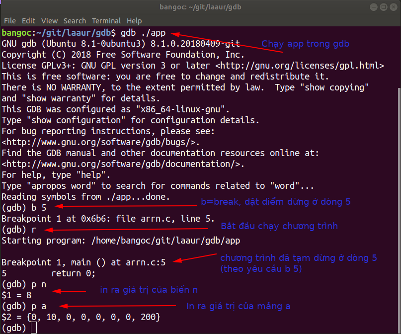
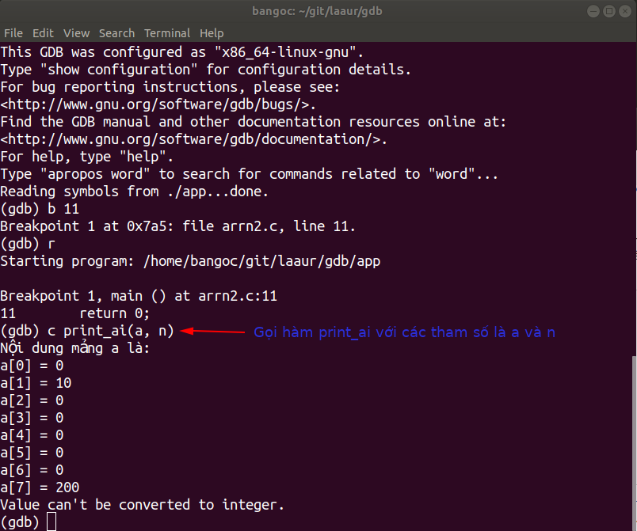

# Gỡ lỗi mức mã nguồn với gdb
## Các yêu cầu môi trường
**GNU/Linux, ví dụ Ubuntu**

Cần có gcc và gdb, có thể sử dụng apt để cài đặt nếu chưa có:
	
	sudo apt-get install gcc gdb
	
**Windows**

Có thể sử dụng bản cài đặt TDM-GCC, trong đó đã có gcc và gdb cho Windows. Có thể tham khảo thêm chi tiết ở [C in Windows](https://github.com/bangoc/c-in-windows) 

## 1. In nội dung của biến trong gdb
### 1.1. Hàm print của gdb
Lấy ví dụ một mã nguồn đơn giản và có chút bí ẩn như sau
	
	// Tệp arrn.c
	1. #include <stdio.h>
	2. int main() {
	3. 	int a[] = {[1] = 10, [7] = 200};
	4.	int n = sizeof(a) / sizeof(a[0]);
	5.	return 0;
	6. }

Bạn muốn biết giá trị của biến n và các phần tử của mảng a? Có thể làm như sau:

**Bước 1.** Biên dịch mã nguồn với khóa -g, ví dụ có thể gọi lệnh sau (lưu ý sử dụng đúng đường dẫn đến tệp arrn.c):

	gcc -g arrn.c -o app

**Bước 2.** Chạy app với gdb, ví dụ có thể gọi lệnh sau:

	gdb ./app

**Bước 3.** Các thao tác trong gdb

1\. Đặt các điểm tạm dừng để quan sát trước khi bắt đầu chạy chương trình\
Ví dụ: b 5 = dừng ở dòng số 5, không yêu cầu tên tệp với chương trình chỉ có một tệp.

2\. Chạy chương trình\
Ví dụ: r = run, bắt đầu chạy chương trình. Chương trình sẽ tạm dừng khi chạy đến các điểm dừng.

3\. In giá trị của các biến để kiểm tra\
Ví dụ: p n = print n, in giá trị của n\
p a = print a, in giá trị của a

Thông báo

	(gdb) p a
	$2 = {0, 10, 0, 0, 0, 0, 0, 200}

đã đủ trực quan hay chưa? Nếu chưa thì làm thế nào để có được thông báo dễ đọc hơn? Chúng ta xem tiếp ở 1.2.

### 1.2. Viết hàm hỗ trợ gỡ rối và sử dụng trong gdb
Chúng ta cập nhật arrn.c, bổ xung thêm một hàm hỗ trợ in ra nội dung mảng theo định dạng ưa nhìn và sử dụng tên mới cho tệp là arrn2.c

	// arrn2.c
	1.  #include <stdio.h>
	2.  void print_ai(int *a, int n) {
	3.     printf("Nội dung mảng a là:\n");
	4.     for (int i = 0; i < n; ++i) {
	5.        printf("a[%d] = %d\n", i, a[i]);
	6.     }
	7.  }
	8.  int main() {
	9.    int a[] = {[1] = 10, [7] = 200};
	10.   int n = sizeof(a) / sizeof(a[0]);
	11.   return 0;
	12. }

Để xem nội dung của mảng bằng hàm print_ai, đầu tiên chúng ta vẫn thực hiện các bước tương tự như 1.1.\
khi chương trình đang tạm dừng, lần này là ở dòng 11, chúng ta gọi hàm print_ai\
Ví dụ: c print_ai(a, n) = call print_ai(a, n), gọi hàm print_ai (đuôi ai có nghĩa là an array of ints).

### Kết luận
Công cụ gdb không chỉ cho phép chúng ta tạm dừng chương trình để xem giá trị của các biến, mà thậm chí còn cho phép can thiệp vào hoạt động của chương trình ở thời gian thực thi.\
Với những biến có biểu diễn đơn giản, trong phần lớn các tình huống sử dụng lệnh p để in ra nội dung là đủ cho nhu cầu kiểm tra.\
Trong những tình huống khó hơn, sử dụng các hàm bổ trợ kết hợp với tính năng gọi hàm trong thời gian tạm ngưng thực thi chương trình cho chúng ta một công cụ mạnh mẽ để kiểm tra nội dung của các biến có nội dung phức tạp với khả năng biểu diễn coi như không giới hạn, và các thao tác cũng rất đơn giản.
